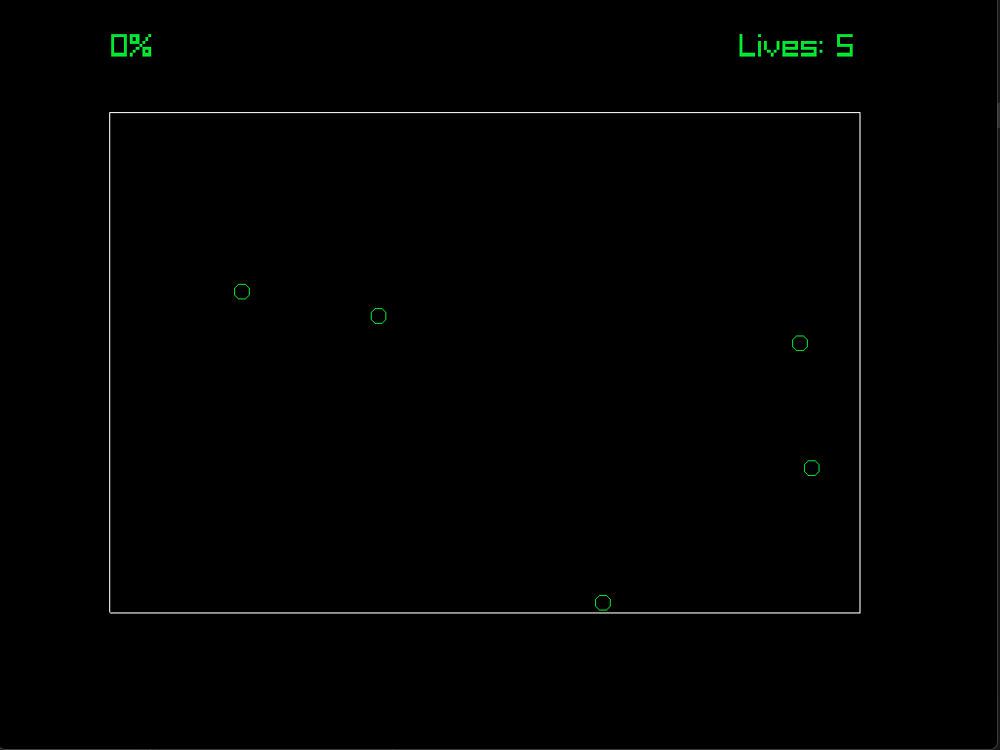

# Yeeball

A JezzBall clone made with odin and raylib.
Your goal is to fill in 75% of the screen with walls.
But be careful and ensure that your extending wall doesn't get hit.
One more ball is added in each level. See how far you can make it!

## Building

Just run ```odin build .```

## Example Gameplay



Controls
---------

| Action                    | Control     |
| ------------------------- | ----------- |
| Extend walls              | Left Click  |
| Rotate                    | Right Click |
